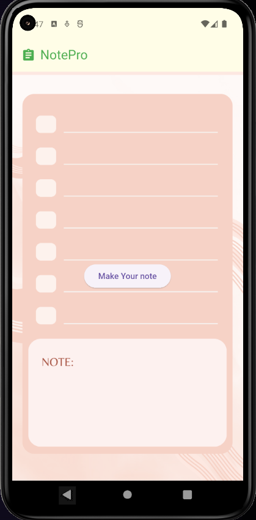
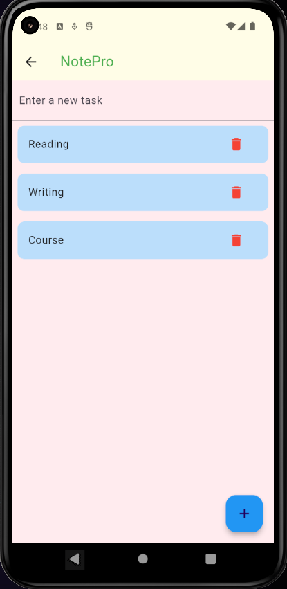
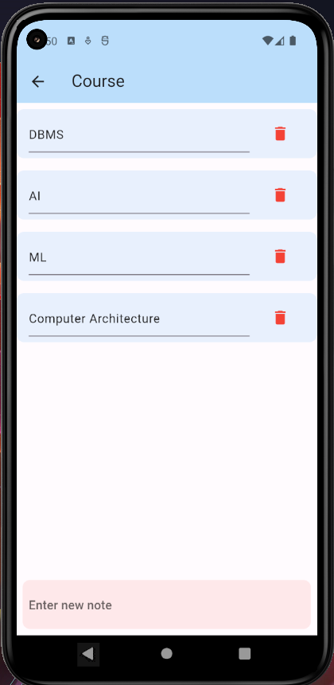

# Basic ToDo List

This is a basic ToDo List application developed during the MAD4B II UIU APP Forum Workshop in Spring 2024.

## Description

This ToDo List app allows users to create tasks, mark them as completed, and delete them. It provides a simple and intuitive interface for managing tasks efficiently.

## Screenshots

<!-- Add screenshots or images of your app in action here -->

   
  
  
 

## Features

- Add tasks with a title
- Mark tasks as completed
- Delete tasks
- Edit task titles
- Add notes to tasks

## Technologies Used

- Flutter
- Dart

## Getting Started

To get started with the app, follow these steps:

1. Clone this repository.
2. Open the project in your preferred IDE or text editor.
3. Run the app on an emulator or physical device.

## How to Contribute

If you would like to contribute to the development of this project, feel free to fork the repository and submit pull requests with your changes.

## License

This project is licensed under the MIT License - see the [LICENSE](LICENSE) file for details.
## Contact Information

**Name:** Md Musfiqur Rahman  
**Status:** Undergraduate CSE Student  
**Email:** [musfiqurm661@gmail.com]

